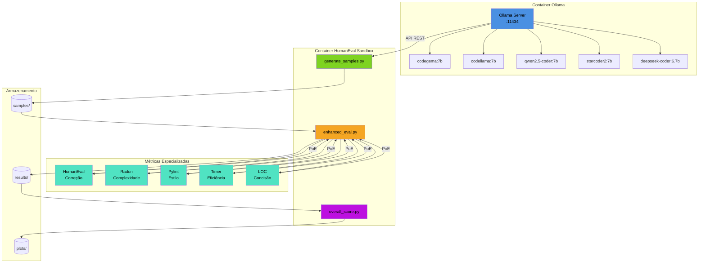
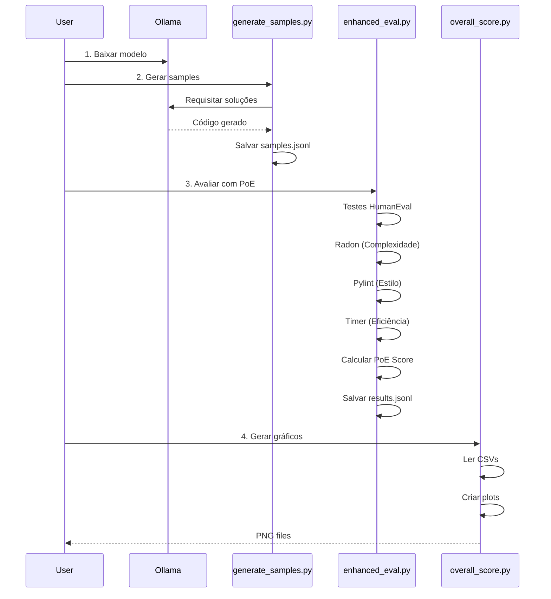

<div align="center">
  
# PoE-Evaluation: Product of Experts para Avaliação de LLMs

**Framework completo para avaliação multidimensional de modelos de linguagem em tarefas de geração de código**

[](https://www.docker.com/)
[](https://www.python.org/)
[](https://ollama.com/)
[](https://github.com/openai/human-eval)

</div>

---

## ❇️ Índice
- [Sobre o Projeto](#sobre-o-projeto)
- [Arquitetura](#arquitetura)
- [Pré-requisitos](#pre-requisitos)
- [Instalação](#instalacao)
- [Pipeline Completo](#pipeline-completo)
- [Métricas do Product of Experts](#metricas-do-product-of-experts)
- [Interpretação dos Resultados](#interpretacao-dos-resultados)
- [Estrutura do Projeto](#estrutura-do-projeto)
- [Comandos Úteis](#comandos-uteis)
- [Referências](#referencias)
- [Licença](#licenca)
- [Autores](#autores)
- [Citação Acadêmica](#citacao-academica)

---

<a name="sobre-o-projeto"></a>
## ❇️ Sobre o Projeto

O **PoE-Evaluation** é um framework robusto para avaliação multidimensional de Large Language Models (LLMs) em tarefas de geração de código. Utilizando o benchmark **HumanEval** como base, o projeto implementa a metodologia **Product of Experts (PoE)** para combinar múltiplas métricas de qualidade em um score unificado e interpretável.

### Principais Características

- **🎯 Avaliação Holística**: Combina correção funcional, complexidade, estilo, eficiência e concisão
- **🧮 Product of Experts**: Algoritmo matemático que pondera múltiplas métricas especializadas
- **🐳 Infraestrutura Containerizada**: Ambiente isolado e 100% reproduzível
- **📊 Visualização Avançada**: Gráficos comparativos automatizados entre modelos
- **🔄 Pipeline Automatizado**: Desde a geração até a análise, tudo em poucos comandos
- **🌐 Compatível com Ollama**: Suporta qualquer modelo disponível na biblioteca oficial

### Use Cases

- Benchmark de modelos de código (CodeLlama, StarCoder, DeepSeek-Coder, etc.)
- Pesquisa acadêmica em avaliação de LLMs
- Seleção de modelos para ambientes de produção
- Análise de trade-offs entre tamanho e qualidade de modelos

---

<a name="arquitetura"></a>
## ❇️ Arquitetura



### Componentes

| Componente | Função | Tecnologia |
|------------|--------|------------|
| **Ollama** | Hospeda e serve modelos LLM via API REST | Ollama Server |
| **HumanEval Sandbox** | Ambiente isolado para execução e testes | Docker + Python |
| **generate_samples.py** | Gera soluções de código para 164 problemas | Requests + HumanEval |
| **enhanced_eval.py** | Avalia 5 métricas e aplica PoE | Radon + Pylint + HumanEval |
| **overall_score.py** | Gera visualizações comparativas | Matplotlib + Seaborn |

---

<a name="pre-requisitos"></a>
## ❇️ Pré-requisitos

### Software Necessário

- **Docker Desktop** 20.10+ ([Download](https://www.docker.com/products/docker-desktop/))
- **Docker Compose** 2.0+ (incluído no Docker Desktop)
- **Git** (para clonar o repositório)

### Requisitos de Sistema

| Recurso | Mínimo | Recomendado |
|---------|--------|-------------|
| RAM | 8 GB | 16 GB+ |
| CPU | 4 cores | 8+ cores |
| Armazenamento | 15 GB | 30 GB+ |
| SO | Linux/macOS/Windows | Linux (melhor performance) |

---

<a name="instalacao"></a>
## ❇️ Instalação

### 1. Clone o Repositório

```bash
git clone https://github.com/tcc-inatel-2025/PoE-Evaluation.git
cd PoE-Evaluation
```

### 2. Construa os Containers

```bash
docker compose build
```

### 3. Inicie os Serviços

```bash
docker compose up -d
```

### 4. Verifique o Status

```bash
docker ps
```

---

<a name="pipeline-completo"></a>
## ❇️ Pipeline Completo

### Visão Geral do Fluxo



---

### Passo 1.: Baixar Modelos no Ollama

Entre no container do Ollama:

```bash
docker exec -it ollama bash
```

Baixe os modelos desejados:

```bash
# Modelos médios (1-7B parâmetros)
ollama pull codegema:7b
ollama pull codellama:7b
ollama pull qwen2.5-coder:7b
ollama pull starcoder2:7b

# Modelos avançados (> 7B parâmetros)
ollama pull deepseek-coder:6.7b
```

**Dica**: Comece com modelos pequenos para testar o pipeline antes de avaliar modelos maiores.

Saia do container:

```bash
exit
```

---

### Passo 2.: Gerar Amostras de Código

Entre no container do HumanEval:

```bash
docker exec -it humaneval_sandbox bash
cd /workspace
```

Execute o gerador:

```bash
python generate_samples.py
```

**Parâmetros disponíveis:**

| Parâmetro | Descrição | Padrão |
|-----------|-----------|--------|
| `--model` | Nome do modelo no Ollama | `smollm2:135m` |
| `--url` | URL do servidor Ollama | `http://ollama:11434` |
| `--num-samples` | Amostras por problema | `1` |
| `--output` | Arquivo de saída customizado | `samples/{model}_samples.jsonl` |

---

### Passo 3.: Avaliar com Product of Experts

Execute a avaliação completa:

```bash
python enhanced_eval.py 
```

**O que acontece nesta etapa:**

1. **🧪 Correção Funcional**: Executa testes unitários do HumanEval
2. **📊 Complexidade Ciclomática**: Analisa com Radon 
3. **🎨 Qualidade de Estilo**: Verifica com Pylint (score 0-10)
4. **⚡ Eficiência**: Mede tempo de execução
5. **📏 Concisão**: Conta linhas de código (LOC)
6. **🧮 Score PoE**: Calcula produto geométrico normalizado

**Arquivos gerados:**
- `results/deepseek-coder_6.7b_results.jsonl` → Resultados detalhados
- `results/summary/deepseek-coder_6.7b_summary.csv` → Resumo para análise

---

### Passo 4.: Visualizar Resultados

Gere gráficos comparativos:

```bash
python overall_score.py
```

**Gráficos gerados:**

1. **`overall_score_distribution.png`**
   - Distribuição dos scores PoE
   - Histograma + KDE
   
2. **`metrics_mean.png`**
   - Média de cada métrica individual
   - Gráfico de barras horizontais

3. **`metrics_correlation.png`**
   - Heatmap de correlação entre métricas
   - Identifica dependências

4. **`model_comparison.png`**
   - Comparação lado a lado de todos os modelos
   - Heatmap multidimensional

---

### Passo 5.: Exportar Resultados para o Host

No terminal do seu computador (fora dos containers):

```bash
# Exportar todos os resultados
docker cp humaneval_sandbox:/workspace/samples ./
docker cp humaneval_sandbox:/workspace/results ./
docker cp humaneval_sandbox:/workspace/plots ./
```

Agora você terá toda a estrutura de arquivos localmente!

---

<a name="metricas-do-product-of-experts"></a>
## ❇️ Métricas do Product of Experts

### Fórmula Matemática

O score PoE combina múltiplas métricas usando média geométrica ponderada:

```
Score_PoE = Functional_Correctness × Quality_Score

onde:

Quality_Score = (CC^α × Style^β × Efficiency^γ × LOC^δ)^(1/4)

Pesos:
α = 1 (Complexidade Ciclomática)
β = 1 (Estilo/Pylint)
γ = 1 (Eficiência)
δ = 1 (Lines of Code)
```

### Métricas Individuais

| Métrica | Ferramenta | Escala | Descrição | Peso |
|---------|-----------|--------|-----------|------|
| **Correção Funcional** | HumanEval | {0, 1} | Passa em todos os testes? | Binário (gate) |
| **Complexidade Ciclomática** | Radon | [0, 1] | Simplicidade do código | 25% |
| **Qualidade de Estilo** | Pylint | [0, 1] | Conformidade PEP 8 | 25% |
| **Eficiência** | Timer | [0, 1] | Tempo de execução | 25% |
| **Concisão (LOC)** | Contador | [0, 1] | Menos linhas = melhor | 25% |

### Escalamento das Métricas

#### 1. Complexidade Ciclomática (CC)

```python
def scale_cc(value, max_cc=10):
    """
    CC = 1-5   -> Simples (score alto)
    CC = 6-10  -> Moderado
    CC > 10    -> Complexo (score baixo)
    """
    raw_scaled = min(value / max_cc, 1.0)
    return 1.0 - raw_scaled  # Inverte: menos complexidade = melhor
```

**Interpretação:**
- CC = 1: `score = 0.90` (excelente)
- CC = 5: `score = 0.50` (aceitável)
- CC = 15: `score = 0.00` (muito complexo)

#### 2. Estilo (Pylint)

```python
def scale_lint(value, max_score=10):
    """
    Pylint retorna score 0-10
    """
    return min(value / max_score, 1.0)
```

**Interpretação:**
- Pylint 9-10: `score = 0.90-1.00` (excelente)
- Pylint 7-8: `score = 0.70-0.80` (bom)
- Pylint < 5: `score < 0.50` (precisa melhorar)

#### 3. Eficiência

```python
def scale_efficiency(value, max_time=1.0):
    """
    Tempo em segundos
    """
    raw_scaled = min(value / max_time, 1.0)
    return 1.0 - raw_scaled  # Menos tempo = melhor
```

**Interpretação:**
- 0.1s: `score = 0.90` (muito rápido)
- 0.5s: `score = 0.50` (médio)
- > 1.0s: `score = 0.00` (lento)

#### 4. Concisão (LOC)

```python
def scale_loc(loc, ref=50.0):
    """
    Número de linhas
    """
    return max(0.0, 1.0 - min(loc / ref, 1.0))
```

**Interpretação:**
- 10 linhas: `score = 0.80` (conciso)
- 25 linhas: `score = 0.50` (médio)
- 50+ linhas: `score = 0.00` (verboso)

---

<a name="interpretacao-dos-resultados"></a>
## ❇️ Interpretação dos Resultados

### Classificação de Scores

| Score PoE | Badge | Interpretação | Ação Recomendada |
|-----------|-------|---------------|-------------------|
| 0.90 - 1.00 | 🏆 **Excelente** | Código production-ready | Deploy com confiança |
| 0.75 - 0.89 | ✅ **Bom** | Qualidade aceitável | Pequenos ajustes opcionais |
| 0.60 - 0.74 | ⚠️ **Regular** | Funcional mas melhorável | Refatoração recomendada |
| 0.40 - 0.59 | ❌ **Ruim** | Problemas significativos | Revisão necessária |
| 0.00 - 0.39 | 🚫 **Crítico** | Não usar em produção | Reescrever |

---

<a name="estrutura-do-projeto"></a>
## ❇️ Estrutura do Projeto

### Arquivos-Chave

| Arquivo | Descrição | Formato |
|---------|-----------|---------|
| `*_samples.jsonl` | Soluções geradas pelo LLM | `{"task_id": "...", "completion": "..."}` |
| `*_results.jsonl` | Resultados detalhados + métricas | `{"task_id": "...", "passed": true, ...}` |
| `*_summary.csv` | Resumo tabelado para análise | Pandas DataFrame |
| `*.png` | Gráficos comparativos | Imagem (300 DPI) |

---

<a name="comandos-uteis"></a>
## ❇️ Comandos Úteis

### Gerenciamento de Containers

```bash
# Parar todos os containers
docker compose down

# Reiniciar serviços
docker compose restart

# Ver logs em tempo real
docker compose logs -f

# Limpar volumes (CUIDADO: apaga modelos baixados)
docker compose down -v
```
---

<a name="referencias"></a>
## ❇️ Referências

### Papers & Benchmarks

- **HumanEval**: [*Evaluating Large Language Models Trained on Code*](https://arxiv.org/abs/2107.03374) — *Chen et al., 2021*
- **Product of Experts**: [*Training Products of Experts by Minimizing Contrastive Divergence*](https://www.cs.toronto.edu/~hinton/absps/nccd.pdf) — *Hinton, 2002*
- **Efficient LLM Comparative Assessment**: [*A Product of Experts Framework for Pairwise Comparisons*](https://arxiv.org/abs/2404.06587) — *Zhang et al., 2024* 
  
---

### Modelos Recomendados

| Modelo | Parâmetros | Perfil de Uso |
|--------|------------|----------------|
| **CodeGemma** | 7B | Geração de código eficiente e leve |
| **CodeLlama** | 7B | Modelo versátil para aplicações gerais |
| **Qwen2.5-Coder** | 7B | Excelente equilíbrio entre custo e desempenho |
| **StarCoder2** | 7B | Boa relação custo/qualidade para prototipagem |
| **DeepSeek-Coder** | 6.7B | Foco em máxima performance e precisão |

---

<a name="licenca"></a>
## ❇️ Licença

Este projeto está licenciado sob a **MIT License** - veja o arquivo [LICENSE](LICENSE) para detalhes.

```
MIT License

Copyright (c) 2025 [Seu Nome]

Permission is hereby granted, free of charge, to any person obtaining a copy
of this software and associated documentation files (the "Software"), to deal
in the Software without restriction, including without limitation the rights
to use, copy, modify, merge, publish, distribute, sublicense, and/or sell
copies of the Software, and to permit persons to whom the Software is
furnished to do so, subject to the following conditions:

[...]
```

### Atribuições

Este projeto utiliza:
- **HumanEval** © OpenAI (MIT License)
- **Ollama** © Ollama Inc (MIT License)
- **Radon** © Michele Lacchia (MIT License)
- **Pylint** © Python Code Quality Authority (GPL)

---

<a name="autores"></a>
## ❇️ Autores

### Equipe de Desenvolvimento

- [Iza L. Ribeiro](https://github.com/Izalp)
- [Humberto G. F. Silva](https://github.com/humbertogfs55)
- [Caroliny A. Teixeira](https://github.com/carolinyat)


<a name="citacao-academica"></a>
## ❇️ Citação Acadêmica

Se você usar este framework em sua pesquisa, por favor cite:

```bibtex
@software{poe_evaluation2025,
  author = {Humberto and Iza and Caroliny},
  title = {PoE-Evaluation: Product of Experts Framework for LLM Code Evaluation},
  year = {2025},
  publisher = {GitHub},
  url = {https://github.com/tcc-inatel-2025/poe-evaluation},
  version = {1.0.0}
}
```

<div align="center">

### ⭐ Se este projeto ajudou sua pesquisa ou trabalho, considere dar uma estrela!

**Desenvolvido com ❤️ para a comunidade acadêmica**

**Happy Evaluating! 🎉**

</div>
